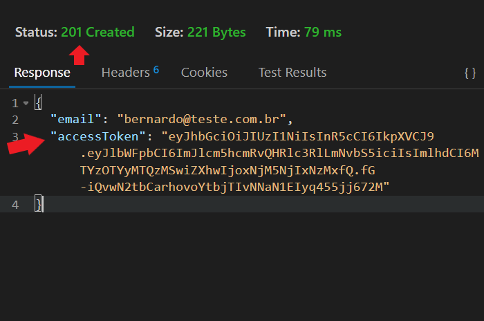

# API REST com NestJS, Prisma e PostgreSQL

Por <a href="https://www.linkedin.com/in/bernardofnoro/">Bernardo Freitas</a> & <a href="https://www.linkedin.com/in/chanelym/">Chanely Marques</a>

**NestJS** é um framework que nos ajuda a escalar de forma eficiente as aplicações construídas em cima do **Node.js**. Possui suporte para **JavaScript** e também **TypeScript**.

Para entendermos como o Nest estrutura e constrói as coisas, uma revisão no assunto de **orientação a objetos** será bastante importante.

O Nest possui diversas semelhanças com o **Express** justamente por ter sido construído em cima dele. Em essência, continuaremos a construir uma API.

## Ferramentas Utilizadas

- VS Code
- Node.js: versão 16.13.0
- NestJs: versão 8.1.6
- Prisma: versão 8.1.0

## Setup Inicial - NestJS

> **Lembrete: :bangbang:** As instalações das dependências necessárias ao sempre devem ser realizadas dentro da pasta do seu projeto, aquela que irá criar com o comando `nest new nome-do-projeto` exceto o pacote @nestjs/cli, que deve ser instalado um nível anterior para permitir a utilização dos comandos nest.

Para começarmos é necessário criar uma pasta para o projeto. Lembre-se que o nome da pasta não deve:

- Conter espaços, e;
- Caracteres especiais.

O nome da pasta deve com toda a certeza **indicar sobre o que o projeto se trata**. Lembre-se que ao programar não está somente consolidando um conhecimento para você, mas também ajudando outras pessoas no processo.

Após criada a pasta, **abra-a** dentro do VS Code.

Agora, vamos instalar um componente do Nest chamado **CLI**. No terminal em seu VS Code execute o seguinte comando.

```` javascript
npm i -g @nestjs/cli
````

Para nossos colegas usando Linux ou Mac, o comando de instalação deve acompanhar o **sudo**:

```javascript
sudo npm i -g @nestjs/cli
```

Este comando utilizará o gerenciador de pacotes **npm** para instalar **globalmente** a Nest **CLI** na pasta do projeto.

Após a instalação, cheque se a instalação foi feita com sucesso através do comando:

```javascript
nest -v
```

Se instalado corretamente, deverá aparecer em sua tela a **versão** do Nest instalada.

Indicando agora ao nest que queremos criar um novo projeto com sua estrutura, o seguinte comando no terminal nos ajudará:

``` javascript
nest new nome-do-projeto
```

No menu do VS Code podemos ver que diversos arquivos e uma estrutura de pastas foi criada.

Na pasta **src**, faça a remoção destes três arquivos:

- app.controller.spec.ts
- app.controller.ts
- app.service.ts

Na pasta **src**, crie a pasta **app** e coloque o arquivo **app.modulde.ts** dentro dela. A árvore de arquivos dentro da pasta do projeto deve estar como abaixo:


Observe que temos alguns pontos em **vermelho**, indicando que algo de errado não está certo! Se abrirmos o arquivo `app.modules.ts` e na barra de opções clicarmos em **problemas**, veremos sobre o quê essas reclamações se tratam.


Estes erros se tratam justamente dos arquivos que excluímos e para resolver este problema, removemos as linhas `2, 3, 7 e 8` do código, deixando-o assim:

```typescript
import { Module } from '@nestjs/common';

@Module({
  imports: [],
})
export class AppModule {}

```

Por hora, não vamos nos preocupar com a funcionalidade do código e sim, ter em mente que este arquivo, **app.modules.ts** é o principal arquivo contendo toda a lógica de funcionamento da nossa API.

No arquivo **main.ts** precisamos dizer que movemos o arquivo **app.module.ts** de lugar:

```typescript
import { NestFactory } from '@nestjs/core';
// Aqui dizemos que o arquivo foi movido
import { AppModule } from './app/app.module';

async function bootstrap() {
  const app = await NestFactory.create(AppModule);
  await app.listen(3000);
}
bootstrap();

```

Altere também o caminho no arquivo **app.e2e-spec.ts** na pasta **test** para o ESLINT não seguir reclamando:

```typescript
import { AppModule } from './../src/app/app.module';
```

## Escopo de Roteamento

> **Importante: :bangbang: ** Antes de experimentar as rotas, por favor, popule o seu banco, procedimento abaixo.

`localhost:10000/api/v1/cuisines`


Em **Cuisines** cuidamos das informações a respeito do país de origem do prato/receita.

>  Collections do Thunder disponíveis para uso!

-----

`localhost:10000/api/v1/ingredients`


Em **Ingredients** cuidamos das informações a respeito dos ingredientes que irão nas receitas/pratos.

> Collections do Thunder disponíveis para uso!

-------

`localhost:10000/api/v1/gauges`


Em **Gauges** cuidamos das informações a respeito dos pesos e medidas utilizados para mensurar a confecção de temperos e preparo de ingredientes.

------

`localhost:10000/api/v1/recipes`


Em **Recipes** cuidamos das informações a respeito dos pesos e medidas utilizados para mensurar a confecção de temperos e preparo de ingredientes.

-----

`localhost:10000/api/v1/spices`


Em **Spices** cuidamos das informações a respeito dos temperos utilizados nas receitas.

------

`localhost:10000/users`


Em **Users** realizamos o cadastro para autenticação e Hash de senha.

-----

`localhost:10000/auth`


Em **Auth** realizamos o Login para utilizar o sistema.

## Entendendo um pouco de relacionamento

(Não, não estamos falando daquele que deveria ser sério :laughing:)

### Relação Um para Um

Em uma relação **um para um**, um dado em uma tabela é associado a outro e **somente** outro dado em outra tabela.

No exemplo abaixo, o campo **cuisineId** na tabela **Recipe** está associado ao campo **id** na tabela **Cuisine**.

Este relacionamento retorna registros relacionados quando o valor dos campos é o mesmo, por exemplo:

- Se o ID do país Brasil na tabela Cuisine for `1`, e;
- O valor `1` também for preenchido no campo cuisineId na tabela Recipe

A informação será corretamente carregada.


### Relação Um para Muitos

Em um relacionamento de **um para muitos**, um **único registro** de uma tabela pode ser associado a **um ou mais registros** em outra tabela ou tabelas.


### Relação Muitos para Muitos

Uma relação **muitos para muitos** acontece quando **vários registros** em uma tabela são associados a **vários registros** em outra tabela.


## PostgreSQL e Prisma - Uma relação de amor e ódio

(Porque o contrário do amor é a indiferença! :blue_heart: )

**Tabela User**

| Campo     | Tipo   | Observações            | Descrição                       |
| :-------- | ------ | ---------------------- | ------------------------------- |
| id        | Int    | Chave-primária         | ID da pessoa usuária            |
| email     | String | Não se repete          | E-mail que servirá de Login     |
| pass      | String |                        | Senha da pessoa usuária         |
| firstname | String | Preenchimento opcional | Primeiro nome da pessoa usuária |
| lastname  | String | Preenchimento opcional | Sobrenome da pessoa usuária     |

**Tabela Cuisine**

| Campo   | Tipo   | Observações            | Descrição                       |
| :------ | ------ | ---------------------- | ------------------------------- |
| id      | Int    | Chave-primária         | ID do país                      |
| country | String |                        | Nome do país                    |
| flagPic | String | Preenchimento opcional | Imagem da bandeira do país      |
| Recipe  |        | Chave-Secundária       | Conexão com a tabela **Recipe** |

Na ferramenta **Query Tool** em seu pgAdmin cole a _query_ abaixo e execute:

```sql
INSERT INTO "public"."Cuisine" (country) VALUES ('Ascension Island'),
('Andorra'),
('United Arab Emirates'),
('Afghanistan'),
('Antigua and Barbuda'),
('Anguilla'),
('Albania'),
('Armenia'),
('Angola'),
('Argentina'),
('American Samoa'),
('Austria'),
('Australia'),
('Aruba'),
('Åland Islands'),
('Azerbaijan'),
('Bosnia and Herzegovina'),
('Barbados'),
('Bangladesh'),
('Belgium'),
('Burkina Faso'),
('Bulgaria'),
('Bahrain'),
('Burundi'),
('Benin'),
('Saint Barthélemy'),
('Bermuda'),
('Brunei'),
('Bolivia'),
('Bonaire, Sint Eustatius and Saba'),
('Brazil'),
('Bahamas'),
('Bhutan'),
('Botswana'),
('Belarus'),
('Belize'),
('Canada'),
('Cocos Islands'),
('The Democratic Republic Of Congo'),
('Central African Republic'),
('Congo'),
('Switzerland'),
('Côte dIvoire'),
('Cook Islands'),
('Chile'),
('Cameroon'),
('China'),
('Colombia'),
('Costa Rica'),
('Cuba'),
('Cape Verde'),
('Curaçao'),
('Christmas Island'),
('Cyprus'),
('Czech Republic'),
('Germany'),
('Djibouti'),
('Denmark'),
('Dominica'),
('Dominican Republic'),
('Algeria'),
('Ecuador'),
('Estonia'),
('Egypt'),
('Western Sahara'),
('Eritrea'),
('Spain'),
('Ethiopia'),
('Finland'),
('Fiji'),
('Falkland Islands'),
('Micronesia'),
('Faroe Islands'),
('France'),
('Gabon'),
('United Kingdom'),
('Grenada'),
('Georgia'),
('French Guiana'),
('Guernsey'),
('Ghana'),
('Gibraltar'),
('Greenland'),
('Gambia'),
('Guinea'),
('Guadeloupe'),
('Equatorial Guinea'),
('Greece'),
('Guatemala'),
('Guam'),
('Guinea-Bissau'),
('Guyana'),
('Hong Kong'),
('Honduras'),
('Croatia'),
('Haiti'),
('Hungary'),
('Indonesia'),
('Ireland'),
('Israel'),
('Isle Of Man'),
('India'),
('British Indian Ocean Territory'),
('Iraq'),
('Iran'),
('Iceland'),
('Italy'),
('Jersey'),
('Jamaica'),
('Jordan'),
('Japan'),
('Kenya'),
('Kyrgyzstan'),
('Cambodia'),
('Kiribati'),
('Comoros'),
('Saint Kitts And Nevis'),
('North Korea'),
('South Korea'),
('Kuwait'),
('Cayman Islands'),
('Kazakhstan'),
('Laos'),
('Lebanon'),
('Saint Lucia'),
('Liechtenstein'),
('Sri Lanka'),
('Liberia'),
('Lesotho'),
('Lithuania'),
('Luxembourg'),
('Latvia'),
('Libya'),
('Morocco'),
('Monaco'),
('Moldova'),
('Montenegro'),
('Saint Martin'),
('Madagascar'),
('Marshall Islands'),
('Macedonia'),
('Mali'),
('Myanmar'),
('Mongolia'),
('Macao'),
('Northern Mariana Islands'),
('Martinique'),
('Mauritania'),
('Montserrat'),
('Malta'),
('Mauritius'),
('Maldives'),
('Malawi'),
('Mexico'),
('Malaysia'),
('Mozambique'),
('Namibia'),
('New Caledonia'),
('Niger'),
('Norfolk Island'),
('Nigeria'),
('Nicaragua'),
('Netherlands'),
('Norway'),
('Nepal'),
('Nauru'),
('Niue'),
('New Zealand'),
('Oman'),
('Panama'),
('Peru'),
('French Polynesia'),
('Papua New Guinea'),
('Philippines'),
('Pakistan'),
('Poland'),
('Saint Pierre And Miquelon'),
('Puerto Rico'),
('Palestine'),
('Portugal'),
('Palau'),
('Paraguay'),
('Qatar'),
('Reunion'),
('Romania'),
('Serbia'),
('Russia'),
('Rwanda'),
('Saudi Arabia'),
('Solomon Islands'),
('Seychelles'),
('Sudan'),
('Sweden'),
('Singapore'),
('Saint Helena'),
('Slovenia'),
('Svalbard And Jan Mayen'),
('Slovakia'),
('Sierra Leone'),
('San Marino'),
('Senegal'),
('Somalia'),
('Suriname'),
('South Sudan'),
('Sao Tome And Principe'),
('El Salvador'),
('Sint Maarten (Dutch part)'),
('Syria'),
('Swaziland'),
('Tristan da Cunha'),
('Turks And Caicos Islands'),
('Chad'),
('Togo'),
('Thailand'),
('Tajikistan'),
('Tokelau'),
('Timor-Leste'),
('Turkmenistan'),
('Tunisia'),
('Tonga'),
('Turkey'),
('Trinidad and Tobago'),
('Tuvalu'),
('Taiwan'),
('Tanzania'),
('Ukraine'),
('Uganda'),
('United States'),
('Uruguay'),
('Uzbekistan'),
('Vatican'),
('Saint Vincent And The Grenadines'),
('Venezuela'),
('British Virgin Islands'),
('U.S. Virgin Islands'),
('Vietnam'),
('Vanuatu'),
('Wallis And Futuna'),
('Samoa'),
('Kosovo'),
('Yemen'),
('Mayotte'),
('South Africa'),
('Zambia'),
('Zimbabwe');
```

**Tabela Gauges**

| Campo       | Tipo   | Observações      | Descrição                       |
| :---------- | ------ | ---------------- | ------------------------------- |
| id          | Int    | Chave-primária   | ID da medida                    |
| gauge       | String |                  | Nome da medida utilizada        |
| description | String |                  | Detalhes sobre a medida         |
| Recipe      |        | Chave-Secundária | Conexão com a tabela **Recipe** |

Na ferramenta **Query Tool** em seu pgAdmin cole a _query_ abaixo e a execute:

```
INSERT INTO "public"."Gauges" (gauge, description) VALUES ('cs', 'Colher(es) de sopa'),
('csb', 'Colher(es) de sobremesa'),
('cc', 'Colher(es) de chá'),
('ccf', 'Colher(es) de café'),
('xc', 'Xícara(s) de chá'),
('xcf', 'Xícara(S) de café'),
('cr', 'Copo(s) de requeijão'),
('cap', 'Copo(s) americano pequeno'),
('cag', 'Copo(s) americano grande'),
('Tbsp', 'Tablespoon'),
('Tsp', 'Teaspoon'),
('Oz', 'Ounce'),
('fl. Oz', 'Fluid Ounce'),
('C', 'Cup'),
('Qt', 'Quart'),
('Pt', 'Pint'),
('gal', 'Gallon'),
('mL', 'Mililiter'),
('g', 'Grams'),
('Kg', 'Kilograms'),
('L', 'Liter(s)');
```

**Tabela Spice**

| Campo    | Tipo   | Observações            | Descrição                       |
| :------- | ------ | ---------------------- | ------------------------------- |
| id       | Int    | Chave-primária         | ID do tempero                   |
| name     | String |                        | Nome do tempero                 |
| quantity | Int    | Preenchimento opcional | Quantidade a ser utilizada      |
| gaugeId  | Int    | Chave-Secundária       | Conexão com a tabela **Gauges** |
| spicePic | String | Preenchimento opcional | Imagem do tempero               |
| Recipe   |        | Chave-Secundária       | Conexão com a tabela **Recipe** |

Na ferramenta **Query Tool** em seu pgAdmin cole a _query_ abaixo e execute:

```
INSERT INTO "public"."Spice" (name) VALUES ('Alho'),
('Cebola'),
('Sal-refinado'),
('Sal-rosa'),
('Sal-marinho'),
('Louro'),
('Pimenta-do-Reino'),
('Tempero-Baiano'),
('Açafrão'),
('Coentro'),
('Salsa'),
('Cebolinha'),
('Alecrim'),
('Tomilho'),
('Manjericão'),
('Orégano'),
('Pimenta-Calabresa'),
('Azeite');
```

**Tabela Ingredients**

| Campo         | Tipo   | Observações                               | Descrição                       |
| :------------ | ------ | ----------------------------------------- | ------------------------------- |
| id            | Int    | Chave-primária                            | ID do ingrediente               |
| name          | String |                                           | Nome do ingrediente             |
| quantity      | Int    | Preenchimento opcional                    | Quantidade a ser utilizada      |
| gaugeId       | Int    | Chave-Secundária e preenchimento opcional | Conexão com a tabela **Gauges** |
| ingredientPic | String | Preenchimento opcional                    | Imagem do ingrediente           |
| Recipe        |        | Chave-Secundária                          | Conexão com a tabela **Recipe** |

Na ferramenta **Query Tool** em seu pgAdmin cole a _query_ abaixo e execute:

```
INSERT INTO "public"."Ingredients" (name) VALUES ('Azeite de Dendê <3'),
('Camarão'),
('Caranguejo'),
('Leite de Coco'),
('Graviola'),
('Mandioca'),
('Milho'),
('Carne Seca'),
('Pequi'),
('Arroz'),
('Feijão'),
('Ovo'),
('Palmito'),
('Banana'),
('Batata'),
('Fava'),
('Lentilha'),
('Couve'),
('Repolho');
```

**Tabela Recipe**

| Campo         | Tipo   | Observações            | Descrição                            |
| :------------ | ------ | ---------------------- | ------------------------------------ |
| id            | Int    | Chave-primária         | ID do prato/receita                  |
| name          | String |                        | Nome do prato/receita                |
| cuisineId     | Int    | Chave-Secundária       | Conexão com a tabela **Cuisine**     |
| history       | String | Preenchimento opcional | História do prato/receita            |
| ingredientsId | Int    | Chave-Secundária       | Conexão com a tabela **Ingredients** |
| spiceId       | Int    | Chave-Secundária       | Conexão com a tabela **Spice**       |
| prepTime      | String |                        | Tempo de preparo                     |
| servings      | Int    |                        | Quantidade de porções                |
| recipePic     | String | Preenchimento opcional | Imagem da receita                    |

## Autenticação e Autorização com Passport e JWT

(Isso certamente não é coisa de Deus! :fearful:)

Primeiramente precisamos instalar algumas dependências antes de continuarmos com o processo de autenticação! 

Abra o terminal do seu projeto e faça as instalações abaixo.

> - npm install --save @nestjs/passport passport passport-local
> - npm install --save-dev @types/passport-local
> - npm install @nestjs/jwt 
> - npm install bcrypt

Agora precisamos criar a pasta "Auth" em nosso projeto.

No terminal digite:

```javascript
nest g module auth 
nest g service auth
```

Esses comandos criam o arquivo **auth.module.ts** e **auth.service.ts** dentro de uma pasta chamada **auth**.

Vamos deixar nossa pasta pronta pra trabalhar criando os arquivos necessários para a nossa autenticação JWT!

Dentro da pasta **auth**, crie um arquivo chamado **auth.controller.ts** e outro arquivo chamado **jwt.strategy.ts** .

Vamos criar tambem a pasta **dto** e dentro dela criamos o arquivo **login.dto.ts** .

Se você seguiu as instruções corretamente, sua estrutura de pastas deve parecer com a imagem abaixo:




Vamos começar a construir nossa autenticação modificando os arquivos a seguir:

Em nossa API, o usuario **cadastrado** para ser **verificado** precisar informar 2(dois) requisitos: email e pass (abreviação de password).

Então é justamente isso que vamos declarar no **login.dto.ts** :

```typescript
export class LoginDto {
 email: string;
 pass: string;
}
```

No arquivo **auth.module.ts** vamos declarar os componentes que irão auxiliar no processo de autenticação :

```typescript
import { Module } from '@nestjs/common';
import { AuthService } from './auth.service';
import { AuthController } from './auth.controller';
import { PassportModule } from '@nestjs/passport';   // Atenção máxima aos imports necessários para a autenticação!
import { JwtModule } from '@nestjs/jwt';
import { JwtStrategy } from './jwt.strategy';
import { UserService } from 'src/app/users/users.service';
import { PrismaService } from 'src/plugins/prisma/prisma.service';

@Module({
 imports: [
  PassportModule.register({
   defaultStrategy: 'jwt',  // declarando que o JWT será nossa estratégia padrão de autenticação!
   property: 'user',
   session: false,
  }),
     
  JwtModule.register({
   secret: process.env.SECRETKEY, //Aqui é a secret key que precisa ser declarada no arquivo .ENV
   signOptions: {
​  expiresIn: '300s', //Aqui é o tempo de duração do token de permissão.
   },
  }),
 ],

 providers: [UserService, PrismaService, AuthService, JwtStrategy],
 controllers: [AuthController],
 exports: [PassportModule, JwtModule], //Não esquecer de exportar o jwt e passport modules!
})
export class AuthModule {}
```

Já no arquivo **auth.service.ts** vamos configurar a geração do **token** para o usuario:

```typescript
import { Injectable } from '@nestjs/common';
import { JwtService } from '@nestjs/jwt';                     //Atenção máxima aos imports necessários para geração do token!
import { UserService } from 'src/app/users/users.service';
import { LoginDto } from './dto/login.dto';  
import { JwtPayload } from './jwt.strategy';

@Injectable()
export class AuthService {
 constructor(
  private readonly userService: UserService,
  private readonly jwtService: JwtService,    //Declarando o jwt no constructor para a construção do Token!
 ) {}

 async login(loginUserDto: LoginDto) {
  const user = await this.userService.findByLogin(loginUserDto); // findByLogin é função criada no arquivo users.controller                                                              
 const token = this._createToken(user); // Função do token sendo chamada usando o email do usuario
  return {
   email: user.email,
   ...token,
  };
 }
 private _createToken({ email }: LoginDto): any {   // Criando a função de criação do token 
  const user: JwtPayload = { email };
  const accessToken = this.jwtService.sign(user); 
  return {
   expiresIn: process.env.EXPIRESIN, 
   accessToken,                          
  };
 }
}
```

Agora vamos ao arquivo **jwt.strategy.ts**, responsavel pela estratégia de autenticação, em nosso exemplo a informação crucial é o **email** do usuario!

```typescript
import { Injectable } from '@nestjs/common';
import { PassportStrategy } from '@nestjs/passport';   //Atenção máxima aos imports necessários para a estratégia!
import { ExtractJwt, Strategy } from 'passport-jwt';

export interface JwtPayload {
 email: string;  //Aqui é declarado a informação crucial para a autenticação.
}

@Injectable()
export class JwtStrategy extends PassportStrategy(Strategy) {
 constructor() {
  super({
   jwtFromRequest: ExtractJwt.fromAuthHeaderAsBearerToken(),
   secretOrKey: process.env.SECRETKEY,
  });
 }

 validate(payload: JwtPayload) {
  return payload;
 }
}
```

e pra finalizar nossa pasta **auth** o arquivo **auth.controller.ts** ,  responsavel pela configuração de navegação do usuario em nossa API!

```typescript
import { Body, Controller, Get, Post, UseGuards } from '@nestjs/common';
import { AuthGuard } from '@nestjs/passport';           
import { AuthService } from './auth.service';    // Atenção máxima aos imports necessários para a navegação do usuario na rota!
import { LoginDto } from './dto/login.dto';

@Controller('auth')
export class AuthController {
 constructor(private readonly authService: AuthService) {}

 @Post()
 async login(@Body() data: LoginDto) {
  return this.authService.login(data);  //comparando se o que vem do Body está em nosso banco de dados atraves do authService!
 }

 @Get()
 @UseGuards(AuthGuard()) // UseGuards protege a nossa rota! Voce só consegue acessar esse GET se estiver com um token valido!
 async checkLogin() {
  return 'PARABENS, SE VOCÊ ESTÁ LENDO ISSO, VOCÊ CONSEGUIU ACESSAR UMA ROTA PROTEGIDA!';
 }
}
```

